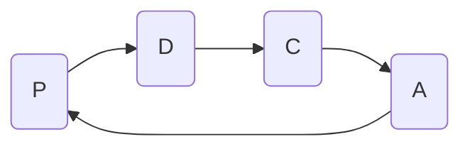

# 授業内容

## ビジネスマナー

### 顧客意識
CS 顧客満足度
### 品質意識
1. QC(Quality control)
2. TQC 会社全体QC
### 納期意識
優先順位
### コスト意識
1. コストパフォーマンス 費用便益比
2. イニシャルコスト 初期費用
3. ランニングコスト 運用費用
### 協調意識
チームワーク
### 目標意識

5W2H

- Who
- Where
- What
- Where
- Why
- How many
- How much

### 時間意識
タイムマネジメント
### 改善意識
1. 無駄・無有・無理を防ぐ
2. 効率化
### PDCAサイクル
- P -> Plan (計画)
- D -> Do (実行)
- C -> Check (検討・評価)
- A -> Action (改善)

## アルゴリズム
#### 命名規則
1. キャメルケース
    - 先頭を英小文字、以降も小文字、言葉の句切は大文字にする
2. パスカルケース
    - 先頭を大文字、以降も小文字、言葉の句切は大文字にする
3. アッパースネークケース
    - 全て文字を大文字にする
#### 流れ図
- カプセル型
- 長方型
- 平行四辺型
- ひし型

# HTML自習
- p
- h1 h2
- ul li
- img